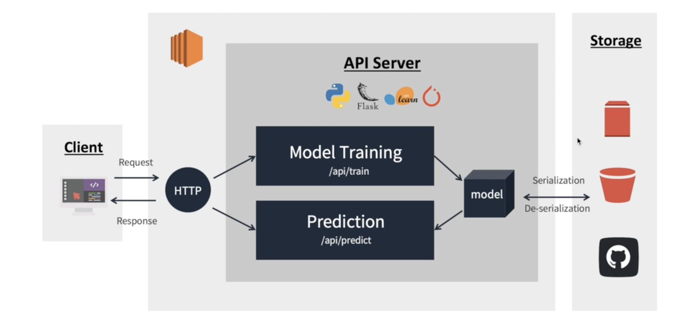
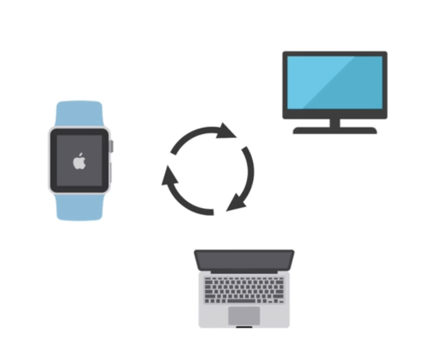
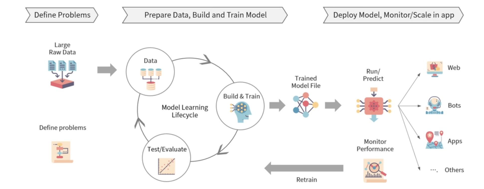
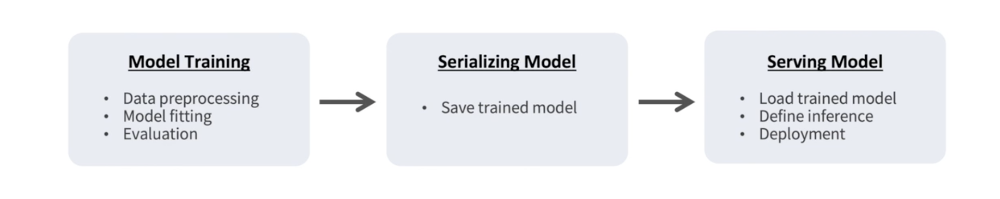

# Architecture of API to serve ML model

## 전반적인 FLOW

AWS EC2와 Python Flask 기반 모델 학습 및 추론을 요청/응답하는 $\mathrm{API}$ 서버 개발 과정을 살펴 봅시다. 전체적인 흐름은 다음과 같은 Flow로 진행 됩니다. 

### Interface

사용자는 기계와 소프트웨어를 제어하기 위해 인터페이스를 정해진 매뉴얼에 따라 활용하여 원하는 경험을 획득하는 것을 의미 합니다.

예를 들어, 컴퓨터의 마우스, 키보드와 같이 입력을 위한 인터페이스와 모니터나 프린터와 같이 정보를 받는 출력을 위한 인터페이스가 있습니다. 따라서, 인터페이스는 **상호** **합의된 매뉴얼에 따라 적절한 입력을 받아 기대되는 출력을 제공**할 수 있어야 합니다. 가령 리모컨의 인터페이스를 예로 들면, 전원 버튼을 눌렀을 때는 TV가 종료(기대되는 출력)되야 합니다. TV가 종료 되지 않는다면 이는 망가진 인터페이스라고 할 수 있습니다. 

### API 란?

> Application Programming <u>Interface</u>의 약자로 기계와 기계, 소프트웨어와 소프트웨어 간의 커뮤니케이션을 위한 인터페이스를 의미합니다.

노드와 노드 간 데이터를 주고 받기 위한 인터페이스로, 사전에 정해진 정의에 따라 입력이 들어왔을 때 적절한 출력을 전달해야 합니다.

예르 들어 다음 그림과 같이 TV, 스마트 워치, 노트북등은 서로 다은 언어로 작동 됩니다. 서로 다른 언어로 작동 되기 때문에 서로 통신하기 위해서는 어느 정도 표준화(합의)된 약속(=인터페이스)가 필요합니다. 이렇게 서로 약속 해둔 방식을 API(활용 가능한 프로그래밍 인터페이스)라고 합니다. 

### RESTful API for ML/DL model inference

> REST 아키텍처를 따르는 API로 HTTP URI를 통해 자원을 명시하고 HTTP Method를 통해 필요한 연산을 요청하고 반환하는 API를 지칭합니다. 

- $\mathrm{RESTful} \mathrm{API}$ 는 데이터나 정보의 교환/요청 등을 위한 인터페이스를 $\mathrm{REST}$ 아키텍처를 따라 구현한 $\mathrm{API}$
- 일반적으로 데이터 값을 담아 요청하고 모델이 추론한 결과에 대한 return을 json 형태로 보통 반환하도록 설계
- $\mathrm{RESTful} \mathrm{API}$ 는 요청 메시지만 봐도 어떤 내용으로 되어있는지 알 수 있도록 표현됨

## Practical process of machine learning

문제정의, 데이터준비, 모델 학습 및 검증, 모델 배포, 모니터링 등의 과정을 통해 실제 서비스에 기계학습 모델을 적용

### Model Serving

학습된 모델을 REST API 방식으로 배포하기 위해서 학습된 모델의 Serialization과 웹 프레임워크를 통해 배포 준비 필요합니다. 전반적인 과정은 다음 그림과 같습니다.

- 모델을 서빙할 때는 학습 시의 데이터 분포나 처리 방법과의 연속성 유지 필요
- 모델을 배포하는 환경에 따라 다양한 Serving Framework를 고려하여 활용

### Serialization & De-serialization

> 학습한 모델의 재사용 및 배포를 위해서 저장하고 불러오는 것을 의미합니다.

- Serialization을 통해 ML/DL model object를 disk에 write하여 어디든 전송하고 불러올 수 있는 형태로 변환과정을 의미합니다.
- De-Serialization을 통해 Python 혹은 다른 환경에서 $\operatorname{model}$ 을 불러와 추론/학습에 사용하게 됩니다.
- 모델을 배포하는 환경을 고려해 환경에 맞는 올바른 방법으로 Serialization을 해야 De-serialization이 가능

