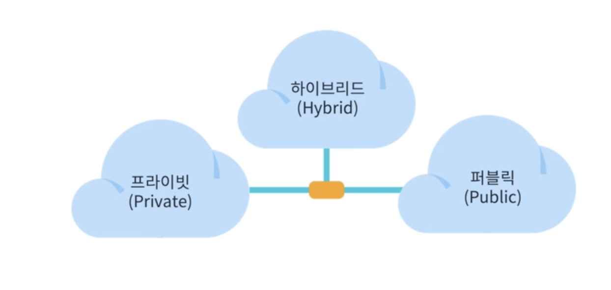
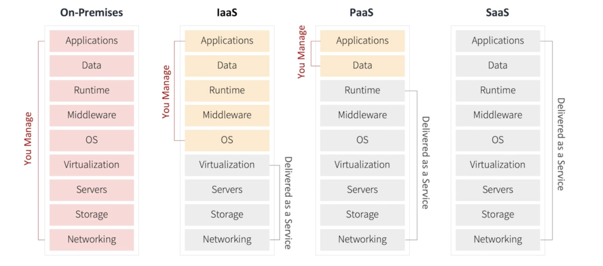

# 1. 클라우드 기초

## 들어가며

### 클라우드 컴퓨팅 이전

과거에는 인터넷 환경에서 서비스를 제공하기 위해서는 서비스 호스팅에 필요한 모든 것을 직접 구축 해야 했습니다. 또한 처음 구축 해야할 때, 사양량을 고려하여 여러가지 등을 고려하여 구축을 해야 했습니다. 

이렇게 직접적으로 서버를 운영하면 직접 구축하고 운영하는 자원과 인력 비용이 크게 들고, 운영 상황의 변화에 능동적으로 대응하기 어려운 단점이 있습니다.

### 클라우딩 컴퓨팅의 수요 증가

제 4차 산업혁명 시대에서 IT기술과 인프라는 빠르게 발전하면서 기존의 서버 구축이나 운영 방식으로는 적절한 시간에 필요한 서비스를 사용자에게 제공하기 어려웠습니다.
때문에, 개별 서버 자원 사용률은 평균 $10 \sim 15 \%$ 였으며 다른 여러 사용자와 공유함으로 사용률을 향상시켜 자원의 효율적인 활용과 이를 통한 비용 절감을 추구하고자 하였습니다.

## 클라우드 컴퓨팅 (Cloud Computing)

언제 어디서나 필요한 만큼의 컴퓨팅 자원을 필요한 시간만큼 인터넷을 통하여 활용할 수 있는 컴퓨팅 방식을 말합니다. 2006년 아마존이 클라우드를 통한 저장공간 및 연산 자원 제공 서비스인 $\mathrm{S}$ 와 $\mathrm{EC}$ 2를 개시하면서 본격적인 클라우드 컴퓨팅 시대를 열게 되었습니다.

### 클라우드 컴퓨팅 운용 모델

클라우드 컴퓨팅은 구축 및 배포 유형에 따라 퍼블릭(Public), 프라이빗(Private), 하이브리드(Hybrid) 클라우드 세 가지 형태로 구분됩니다.

#### 퍼블릭 (Public)

- 서비스 유지를 위한 모든 인프라와 IT기술을 클라우드에서 사용
- AWS, GCP, Azure와 같은 외부 클라우드 컴퓨팅 사업자가 IT자원을 소유하고 인터넷을 통해 제공
- IT관리 인력이나 인프라 구축 비용이 없는 경우에 유용

#### 프라이빗 (Private)

- 고객이 자체 데이터센터에서 직접 클라우드 서비스를 구축하는 형태 
- 내부 계열사나 고객에게만 제공하여 인프라 확충은 쉬우나 IT기술 확보가 어려운 단점이 있
- 보안이 좋고 커스터마이제이션 가능하며 글로벌 클라우드 사업자가 IT기술만 패키지형태로 판매하기도 함

#### 하이브리드 (Hybrid)

- 고객의 핵심 시스템은 내부에 두면서도 외부의 클라우드를 활용하는 형태
- IT기술은 클라우드에서 받고 서비스 유지를 위한 인프라는 고객의 것을 혼용
- 퍼블릭의 경제성과 프라이빗의 보안성 을 모두 고려

### 클라우드 서비스 제공 모델

클라우드 서비스 제공 방식에 따라 IaaS, PaaS, SaaS 세 가지 형태로 구분됩니다.

