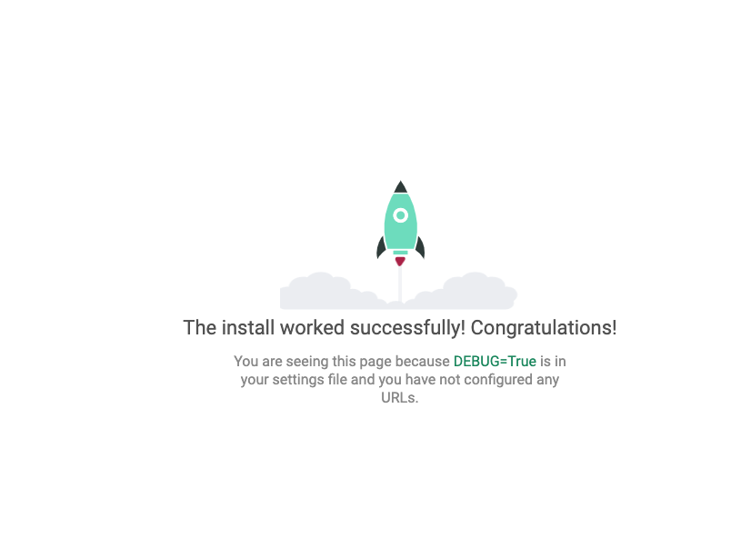

## 들어가며

기존에 배웠던 Flask는 "Micro"라는 말이 항상 앞에 붙는다. Micro Web Framework라고 불린다. 웹 프레임워크를 만드는데 최소한의 기능만을 제공해줘서 여기에 내가 추가 할 부분들을 구현하는 것이다. 반면에, 장고의 경우는 모든것이 내장되어 있어. Flask 대비 큰 덩어리로 시작해서 덩어리의 빈 부분을 채워가는 것이라고 생각하면 쉽다. 

그러므로 Flask는 작은 프로젝트에서, Django는 큰 프로젝트에서 사용하기 적합하다. 

### 가상환경 설치하기

```bash
# 파이썬 가상환경 모듈 설치
$ pip install virtualenv

# 현재 디렉토리에 새 virtualenv 가상환경 만들기
$ virtualenv venv

# 가상환경 활성화
$ source venv/bin/activate
```


## Django Setup

### Django 설치하기

다음과 같은 명령어를 입렵하여 장고를 설치 해준다.

```bash
$ pip3 install django
```


### Django 프로젝트 시작하기

다음과 같이 명령어를 입력하여 장고 프로젝트를 시작할 수 있다.

```bash
$ djnango-admin startproject <projectname>
```

다음과 같이 디렉토리 파일을 확인 해보면 프로젝트 이름으로 된 폴더가 생긴 것을 확일 해 볼 수 있다.

```bash
(venv) ➜  django-proj l
total 0
drwxr-xr-x   4 seungjun  staff   128B May 18 11:49 .
drwxr-xr-x  42 seungjun  staff   1.3K May 18 11:43 ..
drwxr-xr-x   6 seungjun  staff   192B May 18 11:43 venv
drwxr-xr-x   4 seungjun  staff   128B May 18 11:49 webproj
```


해당 폴더로 이동하여 디렉토리를 확인 하면 다음과 같다.`mange.py` 파일과 프로젝트 폴더로 된 또다른 파일을 확인 할 수 있다. 여기서 `mange.py` 파일을 통해서 서버를 실행 할 수 있다.

```bash
(venv) ➜  django-proj cd webproj
(venv) ➜  webproj l
total 8
drwxr-xr-x  4 seungjun  staff   128B May 18 11:49 .
drwxr-xr-x  4 seungjun  staff   128B May 18 11:49 ..
-rwxr-xr-x  1 seungjun  staff   663B May 18 11:49 manage.py
drwxr-xr-x  7 seungjun  staff   224B May 18 11:49 webproj
(venv) ➜  webproj
```


다음과 같은 명령어를 입력하여 웹 서버를 실행 할 수 있다.

```bash
$ webproj python3 manage.py runserver
```

그러면 다음과 같은 화면을 볼 수 있게 된다



<br>

## `setting.py` 구성 요소

`setting.py` 파일은 다음과 같은 Configuration 구성 요소를 지니고 있다.

#### 로그설정

기본은 True로 되어있어 개발시 로그을 남기게 된다.

운영시 꼭 False로 변경을 해준다.

```python
copy python# SECURITY WARNING: don't run with debug turned on in production!
DEBUG = True
```

 

#### APP 등록

생성한 APP들을 모드 등록해준다.

```python
copy python# Application definition

INSTALLED_APPS = [
    'django.contrib.admin',
    'django.contrib.auth',
    'django.contrib.contenttypes',
    'django.contrib.sessions',
    'django.contrib.messages',
    'django.contrib.staticfiles',
    'first_app',
]
```

 

#### Templates 설정

공통적으로 들어가는 html코드를 관리하기 위한 확장형 template들의 경로를 설정할 수 있다.

```python
copy pythonTEMPLATES = [
    {
        'BACKEND': 'django.template.backends.django.DjangoTemplates',
        'DIRS': [os.path.join(BASE_DIR, 'templates')],
        'APP_DIRS': True,
        'OPTIONS': {
            'context_processors': [
                'django.template.context_processors.debug',
                'django.template.context_processors.request',
                'django.contrib.auth.context_processors.auth',
                'django.contrib.messages.context_processors.messages',
            ],
        },
    },
]
```

 

#### DB설정

default로 sqllite를 사용한다.

```python
# Database
# https://docs.djangoproject.com/en/2.1/ref/settings/#databases

DATABASES = {
    'default': {
        'ENGINE': 'django.db.backends.sqlite3',
        'NAME': os.path.join(BASE_DIR, 'db.sqlite3'),
    }
}
```


#### 정적파일 설정

CSS, JavaScript, Images와 같은 정적 파일 경로를 설정해준다.

```python
# Static files (CSS, JavaScript, Images)
# https://docs.djangoproject.com/en/2.1/howto/static-files/

STATIC_URL = '/static/'
```


<br>

## `urls.py`  살펴 보기

```python
from django.contrib import admin
from django.urls import path

urlpatterns = [
    path('admin/', admin.site.urls),
]
```

`url.py` 파일은 위와 같이 작성되어 있다. `path('admin/', admin.site.urls)` 의 의미는 **admin** 이라는 **REQUEST**가 들어오면 이에 대한 **RESPONSE**는 `admin.site.urls` 에서 관장한다는 의미이다.


<br>

## Django 프로젝트와 APP

기존에 `startproject` 명령어를 사용해서 프로젝트 디렉토리를 생성 했다.  이 프로젝트는 여러가지 **App** 으로 구성 된다. 여기서 <u>App의 의미는 특정 명령을 수행하는 view 나 template의 모음</u>이라고 생각한면 된다. 네이버나 구글 사이트를 탐색 할 때 여러가지 기능이 존재한다. 뉴스, 블로그 등.. 그래서 Django는 이러한 모듈화된 기능을 App단위로 제공한다.


### App 만들기

다음과 같은 명령어를 통해 Django앱 디렉토리를 구성 할 수 있다. 여기서 주의 할 점은 프로젝트의 최상위 폴더에서 실행 해야 한다는 점이다. 즉, `manage.py` 파일과 동일한 위치에 있는 폴더에서 실행해야 한다.

```bash
$ls
db.sqlite3 manage.py  webproj

$ django-admin startapp homepage

$ ls
db.sqlite3 homepage   manage.py  webproj
```


### App 폴더 살펴보기

이렇게 생성된 App 폴더를 살펴 보면 다음과 같다.

```bash
homepage
├── __init__.py
├── admin.py
├── apps.py # App에 대한 설정관리
├── migrations
│   └── __init__.py
├── models.py # homepage 모듈에서 쓰이는 DB Schema 등등을 저장
├── tests.py
└── views.py  # hompage의 view 관리
```


## Django의 MVT 패턴

웹페이지를 제작하다 보면 디자인 패턴이라는 것이 존재 한다. 여기서 디자인 패턴이라선 여러가지 모듈화된 동작들을 유기적으로 연결하여 하나의 시스템으로 구성하는 것을 디자인 패턴이라고 한다. Djnago에서는 이러한 목적을 달성하기 위해서 MVT라는 패턴을 사용한다.

다음 그림과 같이 User가 DJango에게 REQUSET를 보낸다. 여기서 장고는 사용자가 보낸 url를 통해 어떠한 REQUESTE가 들어 왔는지를 먼저 체크한다. 확인 된 url를 통해 이 요청을 view로 보내게 된다. view에서는 요청을 처리하는 로직들이 들어 있다. 이 view에서는 DB처리와 웹페이지를 보여주는 template기능이 있다. 참고로, 장고에선 DB관리를 ORM기능으로 처리하고 template에서는 html 파일과 template 언어를 통해 관리 된다.


